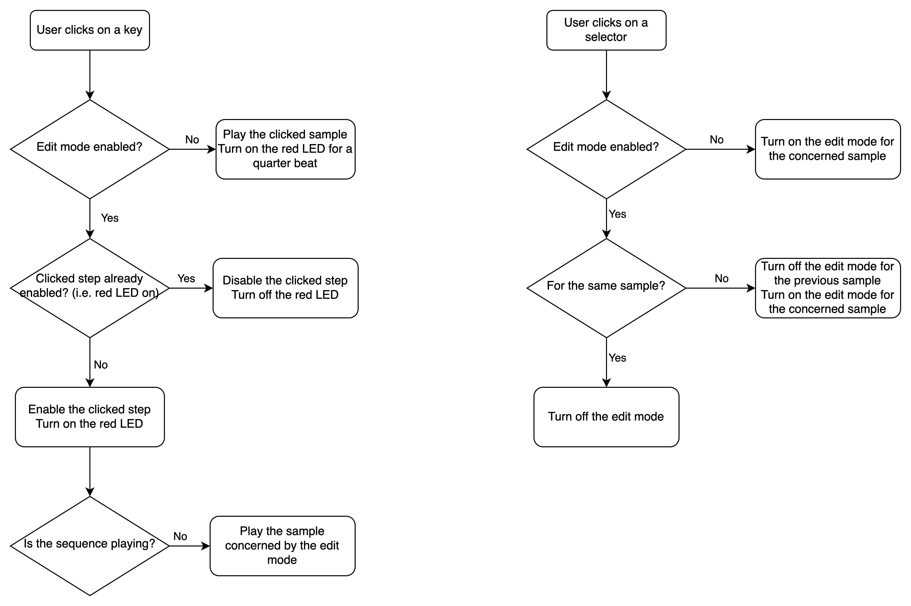
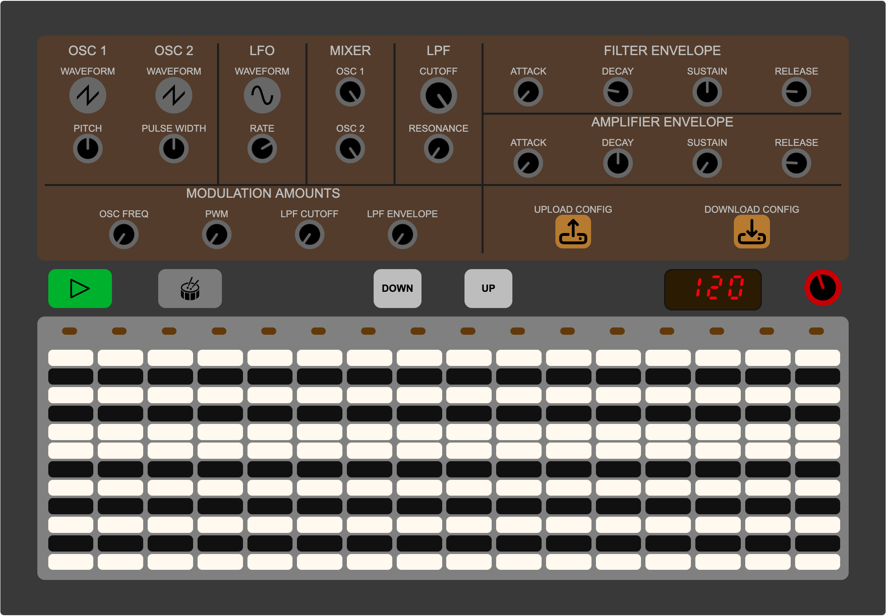
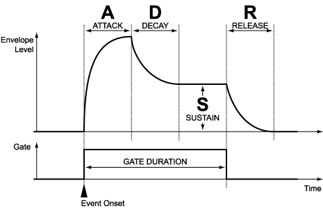
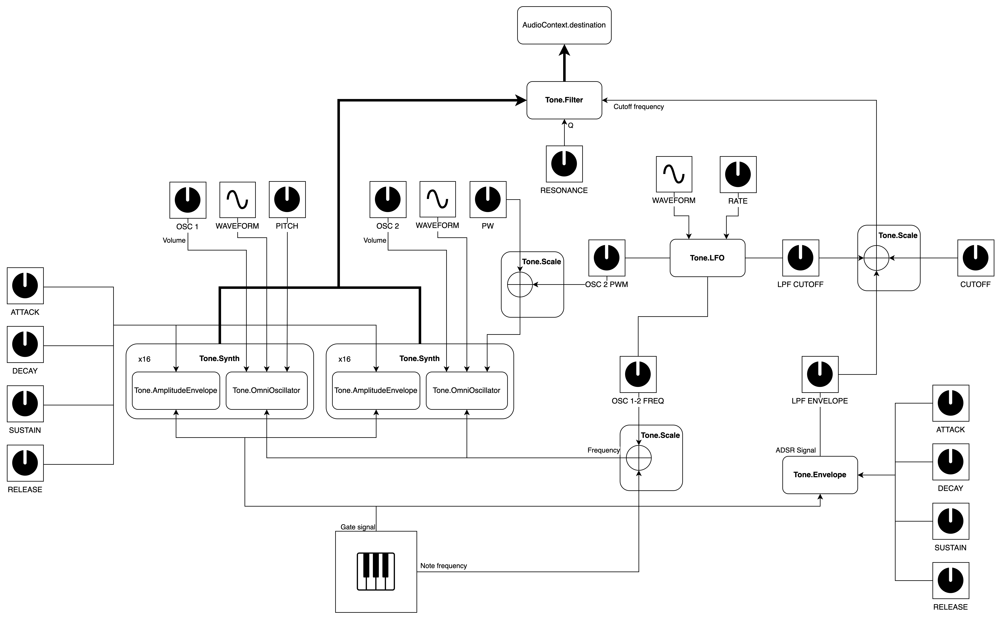

# Introduction
This project is a web application which consists of a combination of a drum machine (sampler), synthesizer and step sequencer. It embeds the most important features to create a sequence of drums and synth notes or chords. While the drum machine uses audio files, the sound of the synthesizer is fully generated by the application itself (see below).

This project is part of the Advanced Coding Tools and Methodologies course from Politecnico di Milano and was created by Thomas Guffroy.

# Technologies and concepts

### Technologies employed
Since it is a web application, HTML was used for the main content of the web page and CSS for formatting and design. Finally, JavaScript was mainly used to:

- dynamically generate the elements of the webpage (keyboard keys, rotating knobs, turn on/off leds when necessary...);
- generate sound, using both the Tone.JS module and the Web Audio API;
- manage the download/upload of audio and JSON files;
- handle all the user's interactions with the application.

Git was used as the version control program and Gogs (a self-hosted Github-like application) was used to store the project files and versions. The repository was then mirrored to a Github one.

### Code organization

The JavaScript file is organized in three main parts:

- the **model**: all the functions and variables related to the model of the application, such as the number of steps to the sequencer, the number of polyphony voices, the Tone.JS nodes and their setting variables;
- the **view**: all the functions related to the display of elements;
- the **controller**: all the functions that handle any interaction between the user and the application to change the sound, add/remove notes, download/upload files, do math calculations such as interpolation, etc...

### Main course concepts addressed

The project addresses the use of audio programming concepts and technolgies namely through the creation of a certainly simple but complete synthesizer.

The possibility of real-time interactions with the application is also to be mentioned, as both the step sequencer and the synthesizer are able to manage any live change in their configuration (rotate knobs to change the sound of the synth, adding/removing notes to the sequencer, changing tempo...)

# Detailed description

The design of the application consists of three main parts:

- the **knobs section** at the top, used to design the sound of the synthesizer and to download or upload the configuration of the application;
- the **controls section** in the middle, which mainly controls the step sequencer (play/pause, tempo, octave Up and Down buttons and synth/drum machine mode button)
- the **play section** at the bottom, where the user can create his own sequences of notes or drum patterns. This last section is dynamically generated depending on whether the user is in the drum machine or synth mode.

Since the audio contexts need a user interaction (like a click) to be started by the web browser, the application first asks the user to click anywhere on the screen to load the knobs section and the play section.

The knobs can be rotated **using the mouse wheel**, except for the waveform selectors of the OSC 1, OSC 2 and LFO, which are clickable.

In the following, the drum machine, synthesizer and step sequencer are explained in details.

## Drum machine
The drum machine consists of 16 default drum samples pre-loaded into the application, ready to be played by the user. The play section has 3 clickable buttons per sequencer step (from top to bottom):

- the sample trigger button (let's call it the key): the sample is played when this key is clicked;
- the edit button: when clicked, it turns orange and the user can then select on which step of the sequencer he wants this particular sample to be played, by clicking on the corresponding key. If selected, the led of the key turns on. To exit the edit mode, either the user clicks again on the edit button, or he clicks on the edit button of another sample which will open the edit mode for this new sample.
- the upload button: the user can upload his own sample instead of the pre-loaded ones by clicking this button and browsing his computer to select any audio file.

Below are the two flow charts, respectively for the drum machine keys (left) and for the select buttons (right).

Example when the user is in edit mode on the fourth sample:

> **Note**: if the edit mode is toggled while the sequence is playing, the sequence continues playing, allowing the user to edit the step sequencer live.

## Synthesizer

The synthesizer consists on **two oscillators** producing sound, with customizable waveform between sawtooth, triangle, pulse and sine. The pitch of the oscillator 1 can be adjusted between -1200 cents and +1200 cents (plus or minus one octave). When a pulse waveform is selected on the oscillator 2, the pulse width can be adjusted between 0% and 100% (50% being a perfect square wave).

The sound produced is sent to a **mixer**, where the volume of both oscillators can be determined independently. The resulting output is then sent to a **low pass filter** (LPF) with a slope of -24dB/octave with customizable cutoff frequency and quality factor (Q).

The resulting signal is finally sent to the master output (we will call it the Amplifier).

The synthesizer also embeds a **LFO** (Low Frequency Oscillator, between 0.01Hz and 20Hz) with customizable waveform (between sawtooth, triangle, square and sine), used to modulate some parameters such as the frequency of the oscillators (e.g. to create a vibrato effect), the cutoff frequency of the filter, or the pulse width of the second oscillator (to create PWM, pulse width modulation).

Finally, two envelopes, one dedicated to the filter and the other one to the amplifier, are triggered each time a note is played, and modulate respectively the cutoff frequency of the filter and the volume of the sound. Since the Tone.Synth object combines both an oscillator and an envelope, the amplifier envelope did not have to be defined separately in the code and the envelope of the Tone.Synth objects were used instead. The two envelopes are both ADSR envelopes (Attack, Decay, Sustain, Release) with exponential curve like in the image below.

A diagram of the synthesizer is represented below, with bold lines representing the sound path. The Tone objects are in bold.

The synthesizer is polyphonic with 16 voices of polyphony (that is why there is a "x16" in the Tone.Synth boxes in the diagram above). It means that at most 16 notes can be played at the same time. It is a technical challenge to achieve this because one oscillator is tuned for only one frequency. That is why both Oscillator 1 and Oscillator 2 actually consist of 16 Tone.Synth objects ready to be triggered at the same time if necessary. For example, when a 3-note chord is played, three Tone.Synth instances for the Oscillator 1 and three other Tone.Synth instances for the oscillator 2 are actually triggered. Moreover, all the modulations that affect a parameter of the oscillators should affect all the 16 (or even 32) Tone.Synth instances.

The keyboard extends from C0 to B6 (7 octaves). Only one octave can be displayed at the same time, therefore two buttons Up and Down in the control section let the user navigate between the 7 octaves of the synth. The 12-key keyboard is represented vertically and duplicated in every step of the sequencer.

## Sequencer
The sequencer is a 16-step sequencer with equal time distance of a fourth beat between each step, which means one complete cycle of the sequencer represents a measure. While this can be sufficient for a drum pattern, it may not be for a melody or chord progression. That is why this value is customizable inside the JavaScript code.

While playing, the progression of the sequence is symbolised with yellow oval-shaped leds on top of the play section.

Each step of the sequencer can carry multiple drum machine samples and up to 16 synth notes (which makes the synth polyphonic). Again this value is customizable inside the JS code. For design reasons, the number of drum machine samples that can be played at the same time is limited to the total number of steps (16 by default), and no more samples than this number can be uploaded by the user.

# Upload/Download configuration

All the parameters of the synth as well as the samples or notes triggered in each step of the sequencer can be downloaded by the user as a JSON file. This ensures the configuration of the user is saved on his computer. The user can then upload this configuration file later and continue playing from where he stopped.

However, even if the sequencer's steps are saved, all the custom samples uploaded by the user are lost, even if he uploads its configuration. These samples have to be re-uploaded again.